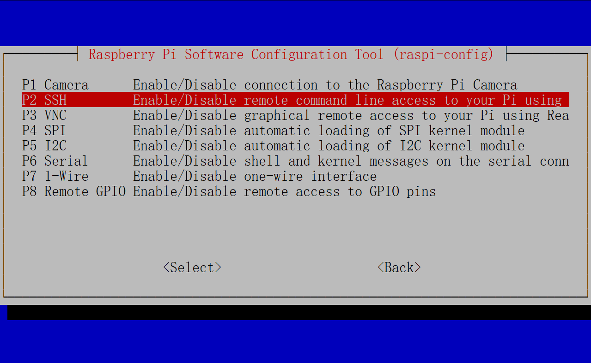
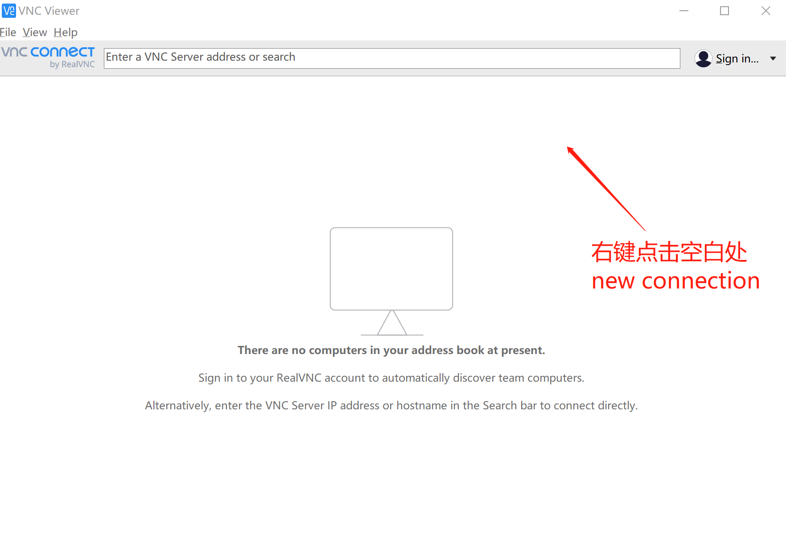

[TOC]

# 第2章 树莓派软硬件准备

在本书中，我们将使用最新的树莓派4B作为开发平台，本章将会依次介绍树莓派的系统刷写，硬件连接，Linux系统的基本操作，远程控制等树莓派的基础知识与操作，最后通过树莓派发出指令的使相机模块拍摄一张照片。

## 2.1 刷写系统

树莓派就像一个小型电脑，需要安装系统以后才能使用。适用于树莓派的操作系统非常多，官方推荐的系统是NOOBS和Raspbian。其中，Raspbian是基于Debian的ARM定制版本，是应用最为广泛的树莓派操作系统，在本书中我们也将主要使用Raspbian OS。其他第三方操作系统都会带有自身的特点，它们往往是在某一方面特别突出，但是其他方面的兼容性则不是特别好，如果只是需要某个特定的功能，那么第三方系统也是比较好的选择。很多 Linux 的发行版本支持树莓派，下面列出一些：

Raspbian Jessie With PIXEL：树莓派官方推荐系统，基于 Debain 8，带 PIXEL 图形界面。特点是兼容性和性能优秀。
Raspbian Jessie Lite：树莓派官方推荐系统，基于 Debain 8，不带图形界面。特点是兼容性和性能优秀，比 PIXEL 版本的安装包更小。
Ubuntu MATE：Ubuntu MATE 是针对树莓派的版本，界面个性美观。
Snappy Ubuntu Core：Ubuntu 针对物联网（IoT）的一个发行版本。支持树莓派。
CentOS：CentOS 针对 ARM 的发行版。支持树莓派。
Windows IoT：微软官方针对物联网（IoT）的一个 Windows 版本。支持树莓派。
FreeBSD：FreeBSD 针对树莓派的发行版。
Kali：Kali 针对树莓派的发行版，黑客的最爱。
Pidora：在 Fedora Remix 基础上针对树莓派优化过的操作系统。


树莓派开发板没有配置板载闪存，但是它支持插入SD卡启动。我们需要通过PC和读卡器将树莓派操作系统烧写在一张不小于8GB存储卡上，一般我们使用32GB的SD卡。烧写的步骤如下：

* 1.在树莓派官方网站(https://www.raspberrypi.org/downloads/raspbian/) 下载Raspbian系统镜像。在该页面下提供了3种Raspbian最新版本Buster的镜像文件。其中，`Raspbian Buster Lite`没有图形化桌面，`Raspbian Buster with desktop`集成了图形化界面，我们选择`Raspbian Buster with desktop and recommended software`下载，它不仅集成了图像化桌面，还预安装了一些常用软件。点击`Download Torrent`或者`Download ZIP`下载，下载完成后可以与官网提供的SHA-256码进行比对以检验镜像文件是否损坏。


* 2.在PC的Windows系统中，使用SD卡的专用格式化软件`SDFormatter`对存储卡进行格式化。在软件界面中选择存储卡对应的盘符，点击格式化按钮即可。


* 3.使用烧写软件`Etcher`或者`Win32DiskImager`将系统刻录在SD卡。这里我们使用支持Windows，macOS以及Linux系统的轻量化软件`Etcher`来烧写。打开`Etcher`后分别选择镜像文件目录以及待烧写SD卡的盘符，点击`flash`即可。


烧写需要大概10-15分钟的时间，时长和设备的读写能力有关。烧写完成后，我们在windows的磁盘管理器中可能看到SD卡的空间只剩下几十MB，这都是正常现象，因为windows无法识别Linux的文件系统。如果系统提示SD卡需要格式化，切记不要选择“是”，这会使我们之前的工作浪费。等待烧写完成，将SD卡插入树莓派背面的SD卡卡槽内，连接硬件就可以使用了。


## 2.2 硬件连接


树莓派4B的内存有1GB/2GB/4GB三种选择，如果一般用于教育目的，1GB的内存就足够了，如果将树莓派作为电脑来使用，则需要至少2GB的内存配置。在树莓派4B的开发板上，有一个USB-C的接口，也就是我们常说的Type-C的接口，树莓派工作时，需要电源适配器提供5V电压，以及3A以上的电流，如果小于这样的电流可能会使树莓派无法工作。树莓派没有开关按钮，只要接上电源就可以启动，拔掉电源就可以关机。除了电源接口外，开发板上还提供了2个Micro-HDMI接口，支持4K分辨率、60帧画面的双屏显示，可以说是很高的显示配置了。树莓派的侧面有2个USB 2.0接口（黑色），2个USB 3.0接口，这里可以接入鼠标、键盘等外设，使得操作更加方便。旁边的以太网接口可以使树莓派接入网络，此外树莓派上还有无线网卡，意味着树莓派可以连接无线网。


为树莓派接上显示屏，键盘，鼠标等外设后，插上电源，可以看到开发板上的红色指示灯长亮，绿色指示灯不规则闪烁，显示器上显示树莓派系统的登录界面，这意味着我们之前的操作没有出什么问题。


点击`next`后，进入地区与语言设置，这里要按照真实的地区选择时区，否则会因为和局域网时间不同步等问题影响树莓派接入网络。建议读者在学习树莓派时选择英语作为系统语言，一方面因为中文的显示有时会出现编码错误，另一方面也方便我们在谷歌上搜索我们遇到的问题。


接下来进入设置网络连接的界面，我们使用无线网来接入局域网，选择了相应的Wifi并输入密码。


接下来系统可能会提示更新软件，选择更新后等待片刻，重新启动树莓派就可以正常使用了。

## 2.3 Linux系统的基本操作

Raspbian是一种Linux系统，我们在使用树莓派之前，需要对Linux的常用命令做一些了解。在Linux系统中，我们在终端中输入并执行命令，按下`Ctrl`+`Alt`+`T`打开一个终端，一起开始吧！

### 2.3.1 `cd`命令

`cd`命令可以用来切换目录，是我们最常用的命令之一。
```
$ cd /TargetPath      # 切换到TargetPath路径下
$ cd ./TargetPath     # 切换到当前目录的TargetPath目录下，“.”是相对路径，代表当前目录。
$ cd ../TargetPath    # 切换到上一级目录的TargetPath目录下，“..”是相对路径，代表上一级目录。
```

### 2.3.2 `ls`命令

`ls`命令用于查看当前目录下的所有文件与子目录，可以直接使用或者搭配参数使用。
```

$ ls -l # 列出长数据串，包含文件的属性与权限数据等
$ ls -a # 列出全部的文件，连同隐藏文件（开头为.的文件）一起列出来（常用）
$ ls -d # 仅列出目录本身，而不是列出目录的文件数据
$ ls -h # 将文件容量以较易读的方式（GB，kB等）列出来
$ ls -R # 连同子目录的内容一起列出（递归列出），等于该目录下的所有文件都会显示出来

```
### 2.3.3 `mv`命令

`mv`命令用于移动文件，它的一些参数和使用示例如下：
```
# -f ：force强制的意思，如果目标文件已经存在，不会询问而直接覆盖
# -i ：若目标文件已经存在，就会询问是否覆盖
# -u ：若目标文件已经存在，且比目标文件新，才会更新
----------------
$ mv -f [file] [dir]           # 移动file到dir，并直接覆盖同名文件
$ mv [file1] [file2] [file3] dir # 把文件file1、file2、file3移动到目录dir中
$ mv [file1] [file2]           # 把文件file1重命名为file2
```

### 2.3.4 `rm`命令

`rm`命令用于删除文件或目录，它的一些参数和使用示例如下：
```
# -f ：就是force的意思，忽略不存在的文件，不会出现警告消息
# -i ：互动模式，在删除前会询问用户是否操作
# -r ：递归删除，将路径下所有文件和目录都删除，是一个非常危险的参数
----------------
$ rm -i [file] # 删除文件file，在删除之前会询问是否进行该操作
$ rm -fr [dir] # 强制删除目录dir中的所有文件
```

### 2.3.5 `apt-get`命令

Linux系统中常用apt(Advanced Package Tool)高级软件工具来安装和卸载软件：
```
$ sudo apt-get install [software] # 安装[software]软件 sudo意为使用管理员权限
$ sudo apt-get remove [software]  # 卸载[software]软件
$ sudo apt-get update [software]  # 更新软件列表
$ sudo apt-get upgrade [software] # 更新已安装软件
```

### 2.3.6 其他常用命令

```
$ cat /proc/version # 查看操作系统版本
$ cat /proc/cpuinfo # 查看主板版本
$ df -h             # 查看SD卡空间使用情况
$ ifconfig          # 查看ip地址
```

### 2.3.7 Vim编辑器的使用

Linux中的Vi/Vim就相当于Windows系统中的记事本，它是Linux中常用的文本编辑器。使用命令`vim [filename]`即可使用Vim打开相应的文件进行编辑。Vim有两种模式：


* 命令模式：在命令模式中可以移动光标、删除字符，但是不可以输入字符，还可以保存文件，设置或退出Vim。
* 插入模式：在插入模式中可以输入字符，按下ESC进入命令模式。

在命令模式中：
```
vim [filename] # 打开filename文件
:w             # 保存文件
:q             # 退出Vim 用于未修改文件时
:q!            # 强制退出Vim 不保存文件
:wq            # 保存并退出

x              # 删除当前字符
nx             # 删除从光标开始的n个字符
dd             # 删除当前行
ndd            # 向下删除当前行在内的n行
u              # 撤销上一步操作
U              # 撤销对当前行的所有操作

yy             # 将当前行复制到缓冲区
nyy            # 将当前行向下n行复制到缓冲区
yw             # 复制从光标开始到行尾的字符
nyw            # 复制从光标开始的n个单词            
y^             # 复制从光标到行首的字符
y$             # 复制从光标到行尾的字符
p              # 粘贴剪切板里的内容到光标后
P              # 粘贴剪切板里的内容到光标前 

:set nu        # 显示行号
:set nonu      # 取消显示行号
```

在插入模式中：
```
a              # 在当前光标位置的右边添加文本
i              # 在当前光标位置的左边添加文本
A              # 在当前行的末尾位置添加文本
I              # 在当前行的开始位置添加文本（非空字符行首）
O              # 在当前行上面新建一行
o              # 在当前行下面新建一行
R              # 替换（覆盖）当前光标位置及后面的若干文本
J              # 合并光标所在行及下一行为一行
```

## 2.4 远程连接树莓派

当身边没有键盘鼠标和显示器等外设时，我们应当如何使用自己的PC来操作树莓派呢？这里我们介绍SSH和VNC两种方式。不管使用哪种方式，在连接之前，我们都需要知道树莓派的IP地址。在树莓派接上键鼠设备与显示器时，我们可以使用`ifconfig`命令查询树莓派的IP地址。如果没有键鼠设备与显示器，将树莓派与手机连接至同一局域网下，使用手机上的Fing软件查看树莓派的IP地址。


### 2.4.1 SSH连接树莓派

新发布的Raspbian系统镜像中默认关闭了ssh服务，我们需要手动打开，如果树莓派此时连接着键鼠与显示器，那么打开终端输入命令：
```
$ sudo raspi-config
```
这样可以打开树莓派的设置界面，选择`Interfacing Options`项下的`P2 SSH`，再选择打开就可以了。




如果树莓派没有连接外设，可以用PC打开SD卡，在boot目录下新建一个名为`ssh`的空白文件，注意不要有后缀。


到这里树莓派的就可以通过ssh来连接了，如果你使用的是Linux或者macOS系统，在终端中直接输入命令：
```
$ ssh pi@192.168.0.110   #替换成你的树莓派IP
```
树莓派的默认用户名是`pi`，密码为`raspberry`，输入完毕后就可以实现通过ssh控制树莓派。

如果使用的是Windows系统，我们需要借助`Putty`软件来实现ssh连接，打开`Putty`，在IP一栏中输入我们之前获取的树莓派IP地址，选择SSH连接。


第一次连接时会和您确认连接密钥，请按“是”确认。只有首次登录会出现这个提示。


输入默认用户名pi，密码raspberry，输入密码时是看不到任何字符的。


这样我们就在windows系统中实现了ssh连接树莓派。在ssh连接中，我们无法使用树莓派的图形化桌面，只能使用终端命令行对其进行操作。

### 2.4.2 VNC连接树莓派（有些故障）

使用VNC连接树莓派时，通过windows上的VNC Viewer，我们可以直接控制树莓派的图形化桌面，就像将PC的键鼠和显示器接入了树莓派一样。在连接之前，还是要打开树莓派的VNC连接选项。首先通过其他方式（外设或ssh）打开树莓派的终端，输入命令：
```
$ sudo raspi-config
```
选择`Interfacing Options`项下的`P3 VNC`，再选择打开就可以了。


我们需要在Windows系统上安装VNC Viewer，它的官方下载地址是https://www.realvnc.com/en/connect/download/viewer/，选择Windows系统与EXE安装文件即可。


安装并打开VNC Viewer之后，我们需要右键点击空白界面新建一个连接，输入树莓派的IP。




第一次登录时需要输入用户名pi，密码raspberry，可以选择记住密码，这样下一次登录就很方便了。

暂时故障

这样我们就可以操作树莓派的图形化界面了。

## 2.5 使用相机模块拍摄一张照片

在熟悉了树莓派的操作方式后，这一小节中我们使用树莓派的摄像头模块Pi Camera来拍摄一张照片。


